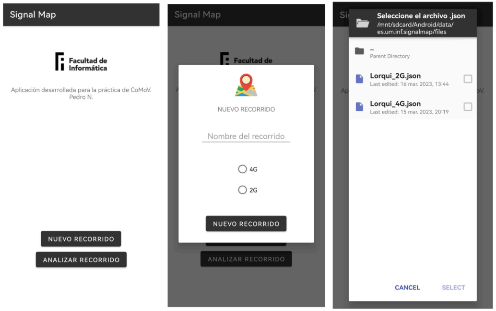
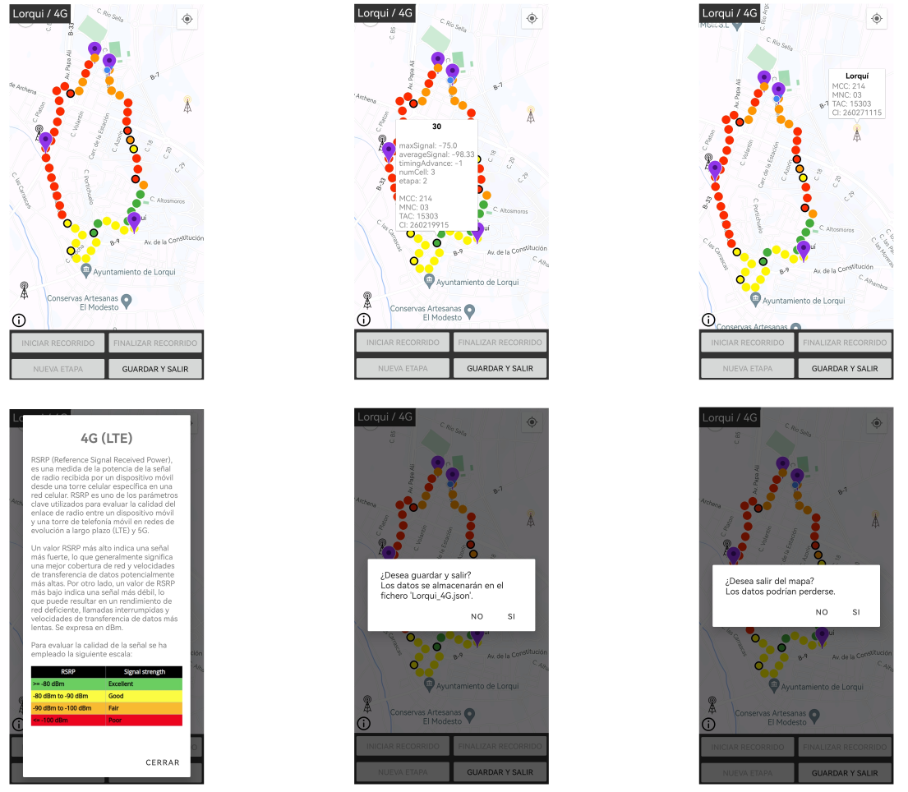
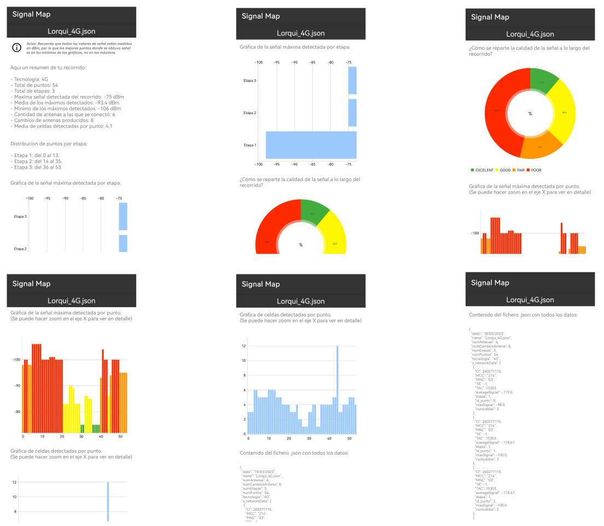
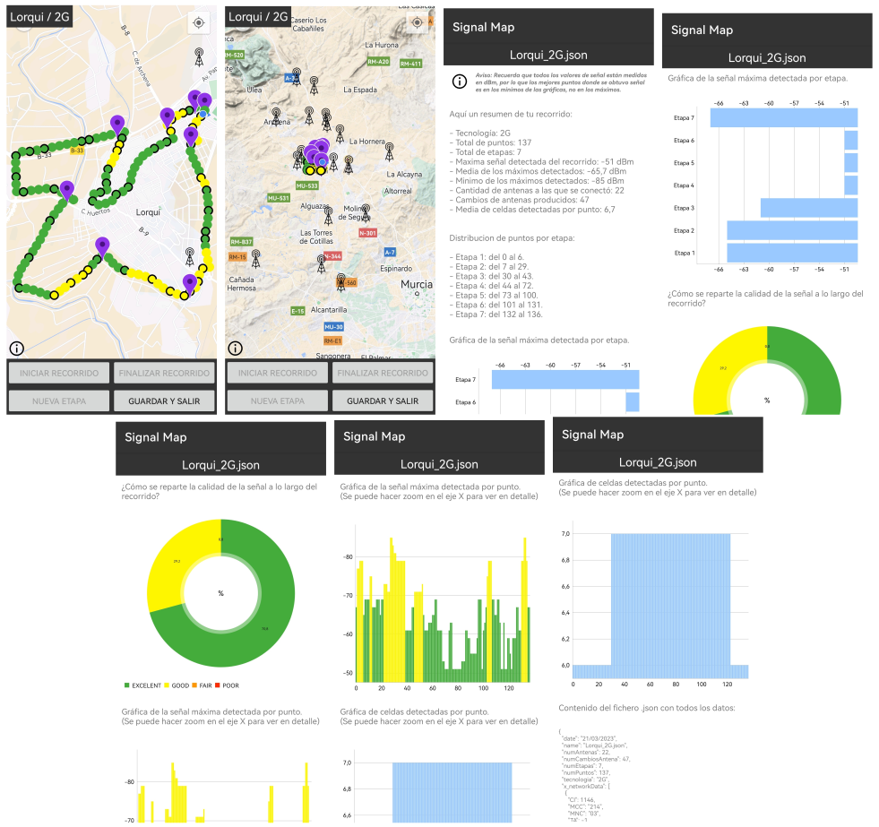
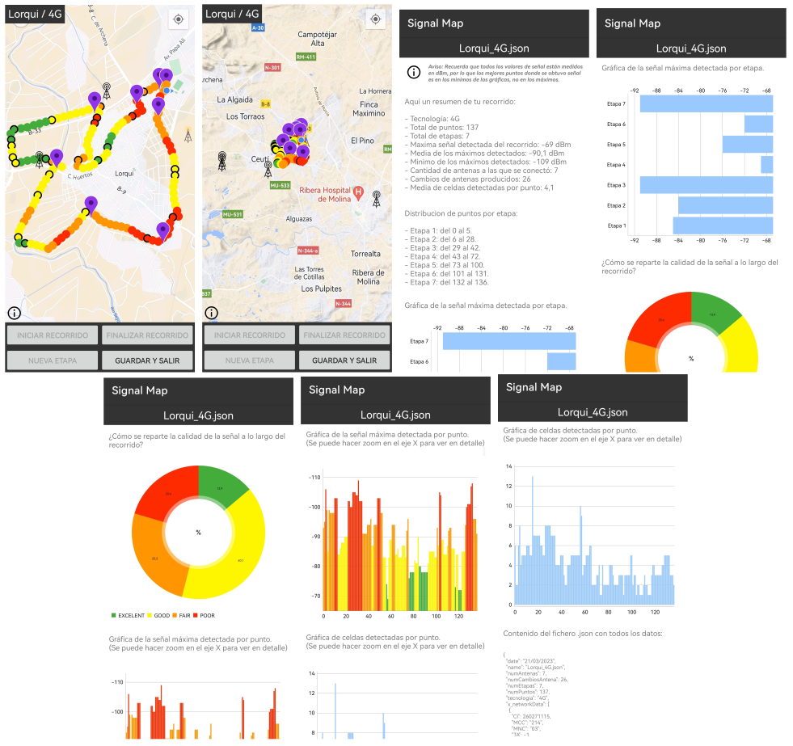

# Signal Map

Aplicación Android desarrollada como parte de la asignatura **Computación Móvil** (Universidad de Murcia, curso 2022/2023). Su propósito es recopilar información de red móvil (2G y 4G) y visualizarla de forma geográfica y gráfica para su posterior análisis.

- [📄 Documentación completa.](./doc/Memoria_CoMov.pdf)

## 🧭 Propósito

Signal Map permite al usuario registrar la intensidad de la señal móvil mientras se desplaza, mostrando esta información sobre un mapa en tiempo real. Los datos se almacenan en el dispositivo para su análisis posterior.

## 📱 Funcionalidades principales

- Recogida de datos de red móvil (2G GSM y 4G LTE) en tiempo real.
- Visualización geográfica de la intensidad de señal mediante código de colores.
- Detección de cambios de antena y delimitación de etapas.
- Almacenamiento local en formato JSON de los recorridos realizados.
- Análisis gráfico de los datos recogidos.

## 🔍 Funcionalidades opcionales

- Comparativa entre tecnologías 2G y 4G.
- Pantalla de análisis (AnalysisActivity) que muestra:
  - Gráfico de barras por etapa.
  - Gráfico circular de distribución de calidad.
  - Evolución de señal por punto.
  - Número de celdas detectadas por punto.
  - Detalles en bruto del JSON.

## 🗺️ Tecnologías y herramientas utilizadas

- **Android SDK** (Java)
- **Google Maps API**
- **Volley** (para peticiones HTTP)
- **GSON** (para serialización/deserialización de objetos)
- **FusedLocationProviderClient** (para geolocalización)
- **FilePicker** (https://github.com/TutorialsAndroid/FilePicker)
- **MPAndroidChart** (https://github.com/PhilJay/MPAndroidChart)

## 📦 Estructura general de la app

### `MainActivity`

- Punto de entrada a la aplicación.
- Permite iniciar un nuevo recorrido o analizar uno existente.

### `MapsActivity`

- Actividad principal de recogida de datos y visualización en mapa.
- Implementación de:
  - Gestión de etapas.
  - Clasificación de señal mediante escala de colores.
  - Identificación de antenas móviles a través de API externa (Mylnikov).
  - Guardado de los datos recogidos.

### `AnalysisActivity`

- Muestra datos del recorrido previamente guardado.
- Utiliza gráficos para facilitar la comprensión visual de los resultados.

## 🧪 Análisis realizado

Se realizaron dos recorridos idénticos de 4,5 km, uno con tecnología 4G y otro con 2G. Se obtuvieron conclusiones sobre:

- Calidad media y máxima de señal por entorno.
- Número de antenas y cambios de antena.
- Diferencias esperadas entre ambas tecnologías (velocidad, latencia, cobertura).
- Impacto del entorno (zona residencial, huerta, carril bici, casco urbano) en la calidad de la señal.

### Recorridos analizados

A continuación se muestran los recorridos realizados:

#### Recorrido con 2G

#### Recorrido con 4G

Se puede observar que, aunque la señal fue más fuerte y estable en 2G, el recorrido evidenció que 4G ofrece una conexión más eficiente y moderna, con menor latencia y mejor capacidad de transmisión, a costa de una cobertura algo más limitada en ciertos entornos. Esta comparación pone de manifiesto las ventajas tecnológicas del 4G frente al mayor alcance del 2G, especialmente en zonas menos urbanizadas.

## 📂 Formato de datos

Los recorridos se almacenan como objetos JSON que incluyen:

- Nombre, tecnología, fecha.
- Número de etapas, puntos, antenas conectadas, cambios de antena.
- Lista de objetos `NetworkData` con detalles por punto (MCC, MNC, TAC/CID, intensidad de señal, antena, etapa, etc).

## 🌍 Multilenguaje

- Aplicación disponible en **español** e **inglés** mediante `strings.xml`.

## ⚠️ Permisos necesarios

- Acceso a la ubicación (precisa y en segundo plano).
- Acceso al almacenamiento para leer y guardar archivos `.json`.

## 👨‍💻 Autor

Pedro Nicolás Gomariz  
pedro.nicolasg@um.es  
Facultad de Informática - Universidad de Murcia

---

_Este proyecto se desarrolló individualmente en el marco académico, como práctica integradora de conceptos de desarrollo móvil, redes de telecomunicaciones y análisis de datos._
